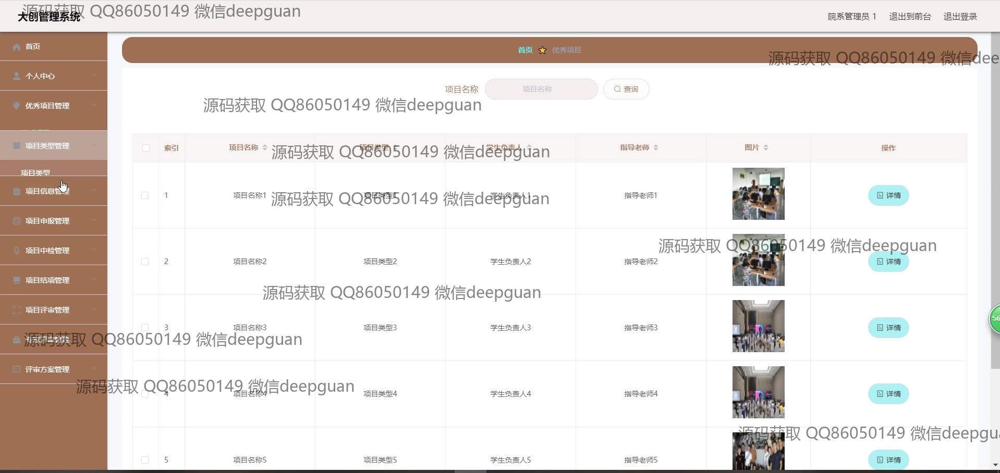

<h1 align="center">基于的大创管理系统</h1>

## 简介
大创管理系统：角色分为学生、指导老师、院系管理员；功能包括用户信息管理、项目申报与审核、项目评审、导师和学生管理、账号密码管理。基于Spring Boot架构，界面简洁高效，支持大创项目的全方位管理。    --计算机毕业设计源码；毕设源码；java毕业设计源码

## 联系方式

<h3 align="center">获取完整代码与数据库文件 + 微信：deepguan QQ: 86050149 QQ群: 783742310</h3>

<h3 align="center">可帮忙远程部署 包运行成功！提供远程部署、修改代码、设计文档指导、代码讲解等服务！</h3>

## 功能介绍（完整见运行截图）
管理员：基本功能包括登录、注册以及退出的能力，并通过后台管理选项对系统设置进行操作。在项目处理上，管理员负责审核项目、管理项目类目，以及对申报的各类项目信息进行管理和监控。系统支持通过搜索功能对项目进行快速定位，还包含导航栏权限设置和用户信息查看及管理。此外，管理员可以管理导师信息、学生信息和项目的评审方案，为整个平台的顺畅运转提供保障。

用户（学生、指导老师、院系管理员等）：可以登录和注册系统账户，并通过个人中心查看和修改个人信息，如账号、密码等。用户能够在网站首页和导航栏中访问优秀项目、项目信息、评审方案和大创资讯等模块。系统提供项目申报、项目中检、项目审查等管理功能，使用户可以提交、查看和更新项目细节，填写评审信息，上传相关文件，并通过简单明确的操作界面对项目的整个生命周期进行自主管理。

## 运行截图

本代码来源于网络,仅供学习参考使用!

